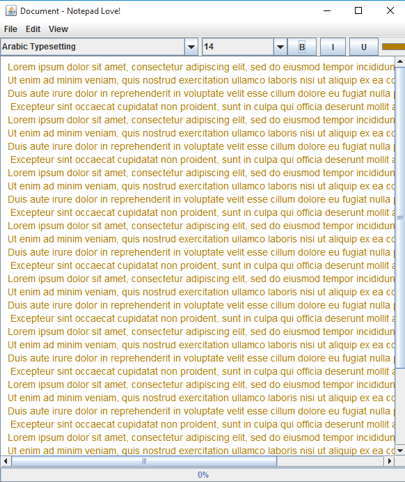

A Simple Text Editor (Notepad love!).

## Features
    *Create, Read, Edit, Save text file
    *Search functionalities
    *Color Change
    *Read text files in audio (in progress)
    

### Requirements
    *Java: JDK >= 7

  

### How to install  
    *Clone Repo  
    *Run Main.java class  

     
    

## License

Text-Editor is licensed under the [MIT license](https://opensource.org/licenses/MIT).

